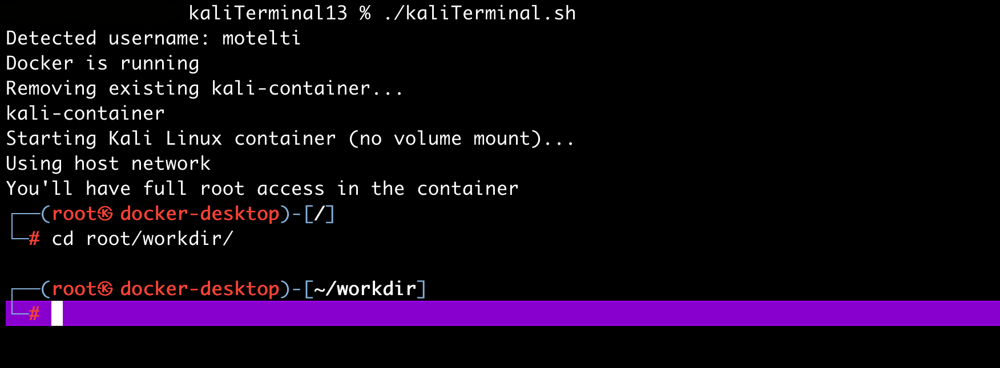

<div align="center">

# ``kaliTerminal13``


</div>

# Kali-in-Docker Terminal (no-admin, persistent workdir)

A minimal, disposable Kali Linux terminal that runs inside Docker so you can install and use security tools without needing admin/root privileges on the host machine.

This is designed for environments where you can’t install software (for example, school or managed computers), but you are allowed to run Docker Desktop. It provides:

- A Kali Linux shell you can customize with `apt`
- A persistent work directory mapped to your host, so your files survive container rebuilds
- Host networking mode requested for better local-network access
- A simple startup script that pulls the image, removes old containers, and launches a fresh root shell

Important: The container starts empty. You must install the tools you need inside the container (run `apt update` first).




---

## What the script does

- Detects your current username
- Ensures Docker Desktop is running (on macOS it tries `open -a Docker`)
- Pulls the latest `kalilinux/kali-rolling` image if not present
- Removes any existing container named `kali-container`
- Starts a new container with:
  - Name: `kali-container`
  - Host networking requested: `--network host`
  - Persistent volume: host directory `/mnt/homes/$USER/goinfre/rootKali` mounted to `/root/workdir` in the container
  - User experience: interactive root shell (`/bin/bash`)

Anything you save in `/root/workdir` inside the container is written to your host folder, so it persists.

---

## Why Docker?

If you don’t have permission to install tools on the host (e.g., `apt install ...` is blocked), running Kali Linux in Docker lets you:

- `apt update && apt install ...` inside the container (no host changes)
- Keep your files on the host via a bind mount
- Throw away the container and start fresh any time, without losing your work

---

## Prerequisites

- Docker Desktop installed and usable on your machine
- Ability to run Docker containers (no need for root on the host if Docker Desktop is allowed)
- A host directory you can write to for persistence (default in this script: `/mnt/homes/$USER/goinfre/rootKali`)

Note for macOS:
- The script uses `open -a Docker` to start Docker Desktop.
- Host networking (`--network host`) is not fully supported on Docker Desktop for macOS and Windows. On those platforms, it often behaves like bridge networking. See “Networking notes” below.

Note for Linux:
- `--network host` works as expected on Linux and attaches the container directly to the host network namespace.

---

## Quick start

1) Make sure Docker Desktop is installed and can run.

2) Create the host directory that will store your work (change the path if needed):
```bash
mkdir -p /mnt/homes/$USER/goinfre/rootKali
```

3) Save the script (for example as `run-kali.sh`) and make it executable:
```bash
chmod +x kaliTerminal.sh
```

4) Run it:
```bash
./kaliTerminal.sh
```

5) Inside the Kali terminal, update and install the tools you need:
```bash
apt update
apt install -y <tool1> <tool2> <tool3>
```

Remember: the container is fresh each run. You must install tools inside the container because the base image is minimal.

---

## Persistence: what saves and what doesn’t

- Files you save in `/root/workdir` (inside the container) persist to the host at `/mnt/homes/$USER/goinfre/rootKali`.
- Anything installed by `apt` is inside the container filesystem and will be lost if the container is removed. This script currently removes the old container each time to ensure a clean environment.

If you want to keep installed packages between runs:
- Option A: Comment out/remove the “remove existing container” step so the container isn’t deleted between runs:
  ```bash
  # if docker ps -a | grep -q "kali-container"; then
  #     echo "Removing existing kali-container..."
  #     docker rm -f kali-container
  # fi
  ```
  Then start the existing container with `docker start -ai kali-container`.

- Option B: Create your own Dockerfile that installs your preferred tools, then run that custom image.

---

## Networking notes

- `--network host`:
  - Linux: Works as intended; container shares host network stack.
  - macOS/Windows (Docker Desktop): “host” networking is limited and often behaves like bridge networking. If you need to reach services on the host, try:
    - Use `host.docker.internal` as the host name.
    - Or publish ports explicitly with `-p <hostPort>:<containerPort>` instead of `--network host`.

If your environment doesn’t allow host networking, remove `--network host` or switch to port publishing.

---

## Customization

- Change the host workdir: edit the `-v` flag
  ```bash
  -v /path/on/host:/root/workdir
  ```
  Ensure the host path exists and is writable.

- Change the container name:
  ```bash
  --name my-kali
  ```

- Keep the container between runs:
  - Remove the auto-delete block as described above.

- Pre-install tools:
  - Build a custom image from `kalilinux/kali-rolling` that runs `apt update && apt install ...` during build.

---

## Common commands

- Enter the existing container (if you kept it):
  ```bash
  docker start -ai kali-container
  ```

- Remove the container:
  ```bash
  docker rm -f kali-container
  ```

- Update the image:
  ```bash
  docker pull kalilinux/kali-rolling
  ```

---

## Troubleshooting

- “Docker is not running”
  - Start Docker Desktop manually, or let the script try on macOS (`open -a Docker`). Wait until the Docker whale icon indicates it’s running.

- “Mount path not found” or “permission denied”
  - Ensure the host directory exists and you have write permission:
    ```bash
    mkdir -p /mnt/homes/$USER/goinfre/rootKali
    ```
  - Change the path to a location you control if necessary.

- “host network not working” on macOS/Windows
  - Use `host.docker.internal` or `-p` port mappings as alternatives.

---

## Reminder: install tools inside the container

After the shell starts:
```bash
apt update
apt install -y <your-tools>
```

The base image is minimal—install whatever you need each session unless you keep the container between runs or build a custom image.

---
